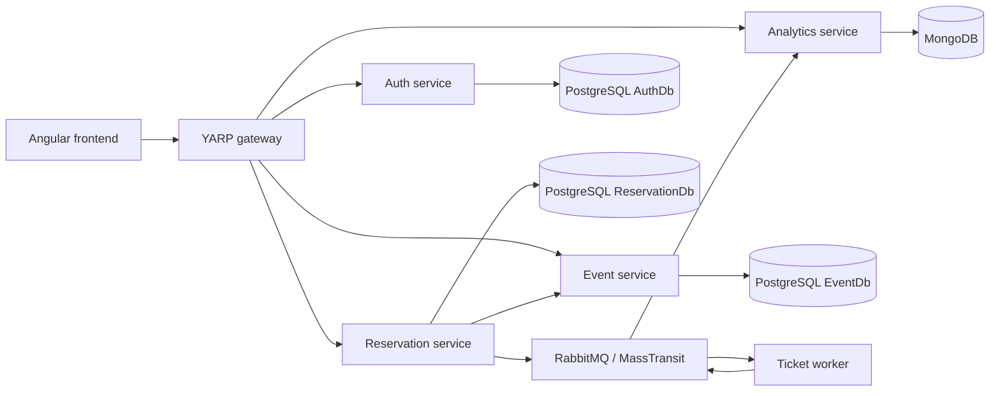

# TicketFlow

An event-ticket reservation demo built with .NET microservices, an Angular frontend, and asynchronous messaging. It separates authentication, event inventory, reservations, ticket processing, and analytics behind a YARP gateway.

## Architecture



| Component | Responsibility |
| --- | --- |
| `TicketFlow.AuthService` | Registration, BCrypt password verification, and JWT issuance |
| `TicketFlow.EventService` | Event catalog and seat availability |
| `TicketFlow.ReservationService` | Reservations, simulated payments, and seat compensation |
| `TicketFlow.TicketWorker` | Consumes reservations and publishes ticket-issued events |
| `TicketFlow.AnalyticsService` | Consumes events and stores analytics in MongoDB |
| `TicketFlow.Gateway` | Reverse proxy, CORS, health endpoint, and reservation rate limiting |
| `TicketFlow.Contracts` | Shared event contracts |
| `ticketflow-frontend` | Angular authentication, event browsing, reservations, and trending events |

## Stack

- **.NET 10** and ASP.NET Core.
- **Angular 22**, TypeScript, and RxJS.
- **PostgreSQL 16** with Entity Framework Core/Npgsql.
- **MongoDB 7** for analytics.
- **RabbitMQ** and **MassTransit** for messaging.
- **YARP** for gateway routing.
- **Docker Compose** for local orchestration.
- **xUnit**, Moq, EF Core InMemory, and Mongo2Go for backend tests.

## Start with Docker Compose

Install Docker with Linux container support and Docker Compose v2, then run from the repository root:

```bash
git clone https://github.com/metehancihangir/TicketFlowMicroService.git
cd TicketFlowMicroService
docker compose up --build -d
docker compose ps
```

Database migrations run when the corresponding services start.

| URL | Purpose |
| --- | --- |
| http://localhost:4200 | Angular frontend |
| http://localhost:5000 | API gateway |
| http://localhost:5000/health | Gateway health |
| http://localhost:15672 | RabbitMQ management UI |

The Compose file uses local demonstration database credentials and a shared development JWT key. It is intended for local evaluation; replace credentials and review network exposure before deployment.

Check startup or messaging issues with:

```bash
docker compose logs -f gateway reservation-service ticket-worker analytics-service
```

Stop the stack with `docker compose down`. Named database volumes are preserved.

## Try the application

1. Open the frontend and register a user.
2. Sign in to obtain a JWT.
3. Browse events and submit a reservation.
4. View your reservations and the analytics/trending view.

A fresh database may have no events. Registration creates a normal `User`, while event creation requires an `Admin` JWT. For a local demo, assign the administrator role to your own account in AuthDb, sign in again, and use `POST /api/events` to create an event.

### Gateway routes

| Prefix | Destination |
| --- | --- |
| `/api/auth` | Authentication service |
| `/api/events` | Event service |
| `/api/reservations` | Reservation service |
| `/api/analytics` | Analytics service |

## Local development and tests

Install the **.NET 10 SDK** and **Node.js 22.12 or later** (check the locked packages' engine requirements when updating dependencies).

Use **TicketFlow.slnx**, which contains the microservices and their tests. `TicketFlowMicroService.slnx` contains a separate starter project.

```bash
dotnet restore TicketFlow.slnx
dotnet build TicketFlow.slnx
dotnet test TicketFlow.slnx
```

The test suite includes EF Core InMemory fixtures and Mongo2Go-backed analytics tests. Mongo2Go must be able to start its bundled MongoDB process.

For frontend development while the Compose gateway is running:

```bash
cd ticketflow-frontend
npm ci
docker compose stop frontend
npm start
```

Stopping the Compose frontend frees port 4200 for the development server. The gateway permits `http://localhost:4200` through CORS. If you choose another port, update that origin in [TicketFlow.Gateway/Program.cs](TicketFlow.Gateway/Program.cs) and rebuild the gateway.

```bash
npm run build
npm test -- --watch=false
```

The frontend API base URL is configured in [environment.ts](ticketflow-frontend/src/environments/environment.ts) and defaults to `http://localhost:5000`.

## Demo boundaries

- Payments are simulated with a small random failure rate; no payment provider is integrated.
- The worker constructs a ticket identifier and logs PDF/email actions. It does not generate a PDF file or send a real email.
- Worker duplicate detection uses in-memory state and does not survive process restarts.
- PostgreSQL and MongoDB use named volumes, while the Compose RabbitMQ service has no persistent volume.
- Production authentication, durable message processing, secret management, and operational hardening need a separate deployment review.

Further requirements and development notes are available in [docs/](docs/).
